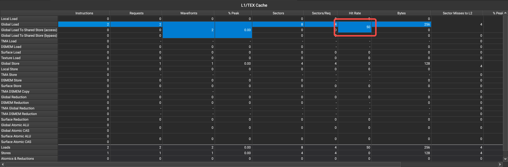
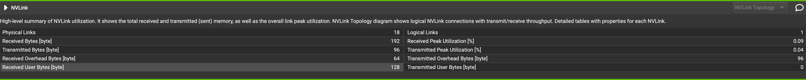
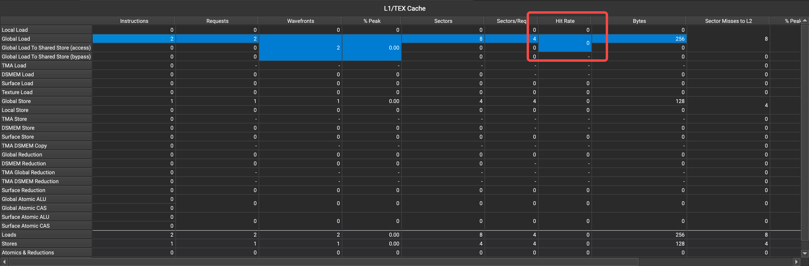
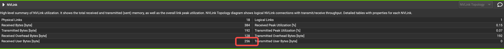
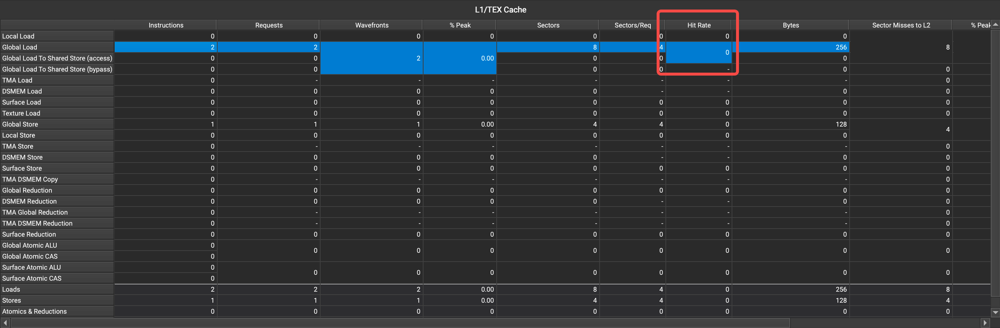
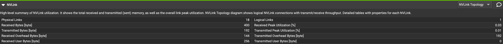

# Cache Operator in Peer Memory Access
Here is a code example that demonstrates peer memory access. The loadPeerMemory kernel performs two peer memory accesses. The first access uses the normal ld instruction and the data in the peer memory will be cached. In the second peer memory access, we use three instructions: ld, ld.volatile, and ld.cv respectively. We observe peer memory access through ncu.

## ld
Normal ld instructions will hit the cache.

The received data volume shown in the NVLink Table also only includes one ld.

## ld.volatile
ld.volatile instructions WILL NOT the cache.

The received data volume shown in the NVLink Table includes 2 * ld.

## ld.cv
ld.cv instructions WILL NOT the cache.

The received data volume shown in the NVLink Table includes 2 * ld.

## Conclusion
Both ld.volatile and ld.cv can bypass cache.

## How to reproduce?
+ compile.sh -- Build program.
+ compile_ptx.sh -- Compile PTX code for checking.
+ run.sh -- Run program.
+ run_profile_entry.sh -- Profile with ncu.

